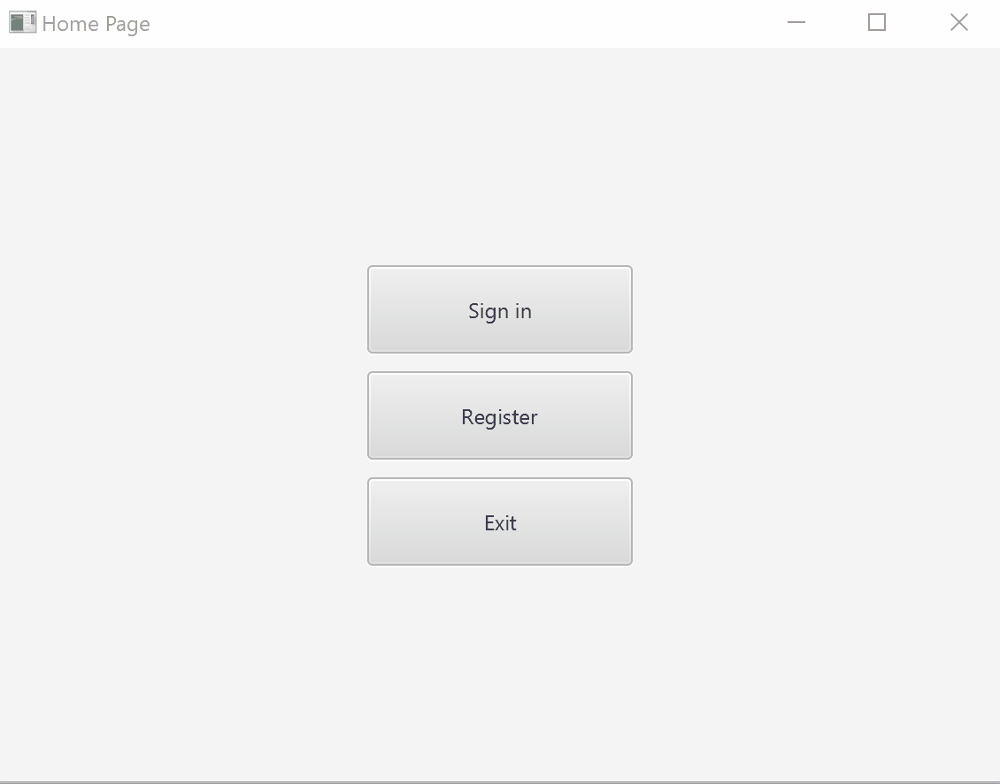
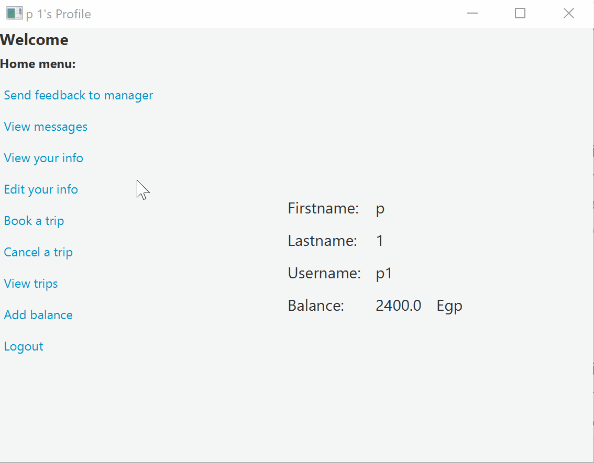
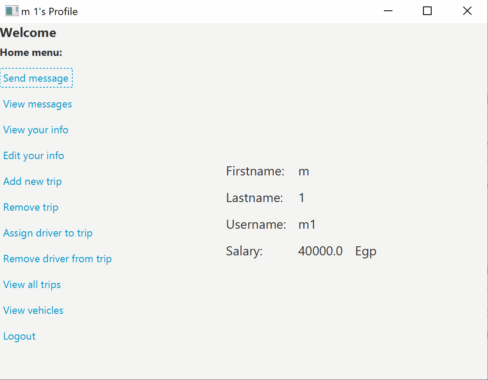
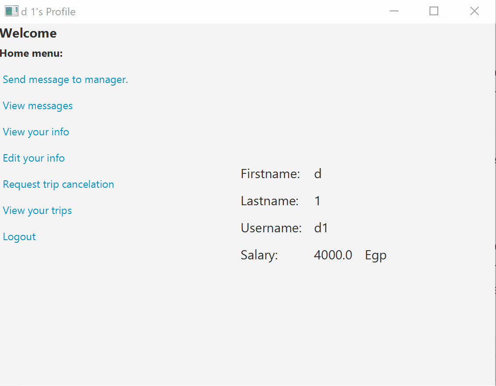

# Bus Station
A simualtion for bus station client app that allows users/bus drivers to manage their trips and allows station managers to take control over all the trips

### Available Options For Station Users:
1. Send/Receive feedback to/from station managers
2. Edit/View their information on the system
3. Book/Cancel/View a trip
4. Add balance
 
### Available Options For Station Managers:
1. Send/Receive feedback to/from others
2. Edit/View their information on the system
3. Add/Remove a trip
4. Assign/Remove driver from/to a trip
5. View all trips/vehicles

### Available Options For Drivers:
1. Send/Receive feedback to/from station managers
2. Edit/View their information on the system
3. Request trip cancelation
4. View their trips
 